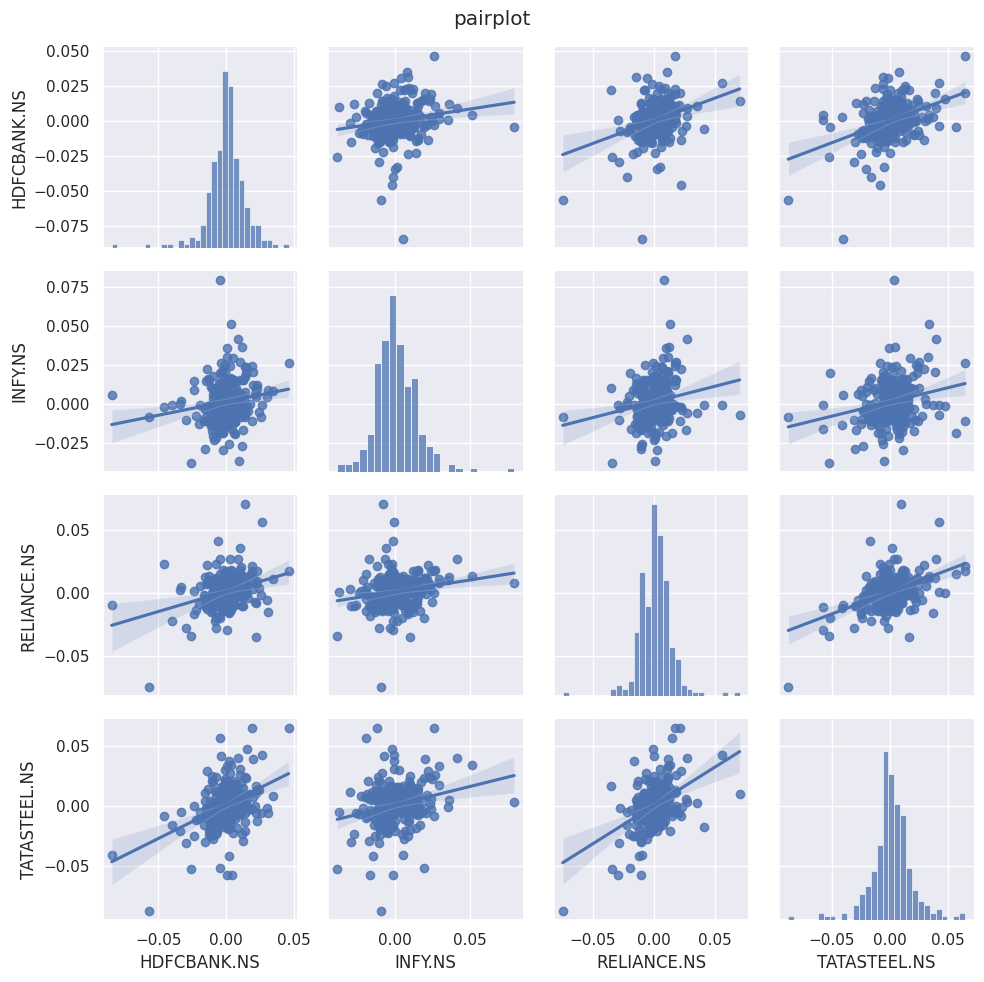
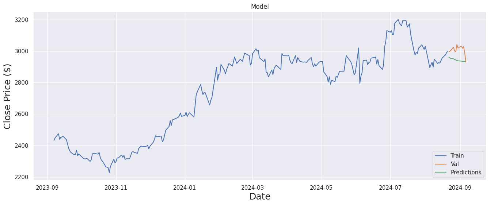

# Stock Price Prediction using LSTM

This project uses Long Short-Term Memory (LSTM) neural networks to predict the stock price of major Indian companies such as HDFC Bank, Infosys, Reliance Industries, and Tata Steel. The dataset is retrieved using the `yfinance` library, and the model predicts the closing stock prices based on historical data.

## Table of Contents
- [Project Overview](#project-overview)
- [Technologies Used](#technologies-used)
- [Installation](#installation)
- [Dataset](#dataset)
- [Model Architecture](#model-architecture)
- [Performance Evaluation](#performance-evaluation)
- [Visualizations](#visualizations)
- [Results](#results)
- [Future Improvements](#future-improvements)

## Project Overview

This repository demonstrates stock price prediction using:

- Data Preprocessing
- Exploratory Data Analysis (EDA)
- LSTM neural networks to model and predict stock prices.

**Key Features**
- Visualizations of stock prices, moving averages, sales volume, and daily returns.
- LSTM-based prediction for the closing price of stocks.
- Performance metrics and error evaluation of the predictive model.

## Technologies Used

- Python 3.8
- `yfinance` for retrieving historical stock data.
- `Pandas` for data manipulation.
- `Matplotlib` and `Seaborn` for visualization.
- `Statsmodels` for time-series analysis.
- `Keras` with TensorFlow backend for building the LSTM neural network.

## Installation

To run this project locally, follow these steps:

1. Clone the repository:

    ```bash
    git clone https://github.com/yourusername/stock-price-prediction.git
    ```

2. Install the required packages:

    ```bash
    pip install -r requirements.txt
    ```

3. Run the `main.py` script to start the analysis:

    ```bash
    python main.py
    ```

## Dataset

The stock price data is fetched from Yahoo Finance using the `yfinance` library. The dataset consists of adjusted closing prices and volume data for four major Indian companies from the NSE (National Stock Exchange) over a 1-year period.

**Stocks Included**
- HDFC Bank (HDFCBANK.NS)
- Infosys (INFY.NS)
- Reliance Industries (RELIANCE.NS)
- Tata Steel (TATASTEEL.NS)

## Model Architecture

The model is built using Keras and contains the following layers:

- LSTM layers with 16 units and swish activation function.
- Dense output layer to predict stock prices.

The data is normalized using `MinMaxScaler`, and a sequence length of 60 is used for time series forecasting.

**Model Summary:**

```python
Model: "sequential"
_________________________________________________________________
 Layer (type)                Output Shape              Param #   
=================================================================
 lstm_1 (LSTM)               (None, 60, 16)            1152      
                                                                 
 lstm_2 (LSTM)               (None, 60, 16)            2112      
                                                                 
 lstm_3 (LSTM)               (None, 16)                2112      
                                                                 
 dense_1 (Dense)             (None, 1)                 17        
                                                                 
=================================================================
Total params: 5,393
Trainable params: 5,393
Non-trainable params: 0
```

## Performance Evaluation

The model's performance is evaluated using Root Mean Squared Error (RMSE), which is calculated by comparing the predicted stock prices with actual prices.

**RMSE Calculation:**

```python
RMSE = np.sqrt(np.mean((predictions - y_test)**2))
```

## Visualizations

Several plots are generated to better understand the data and the performance of the model:

- **Stock Close Prices:** A line plot of adjusted close prices for each stock.
- **Sales Volume:** The daily trading volume of stocks.
- **Moving Averages:** 10, 30, and 50-day moving averages for each stock.
- **Daily Returns:** Line plots and histograms of daily returns.
- **Correlation Heatmap:** Displays the correlation between stocks.
- **Joint and Pair Plots:** Comparing the returns between different companies.




## Results

The trained model makes predictions on stock prices, and the performance is visualized through the comparison of actual vs. predicted prices.



## Future Improvements

- Add more features (technical indicators) to the model.
- Use more sophisticated architectures such as GRU or Transformer models for time-series forecasting.
- Explore more Indian stock symbols beyond blue-chip stocks.


